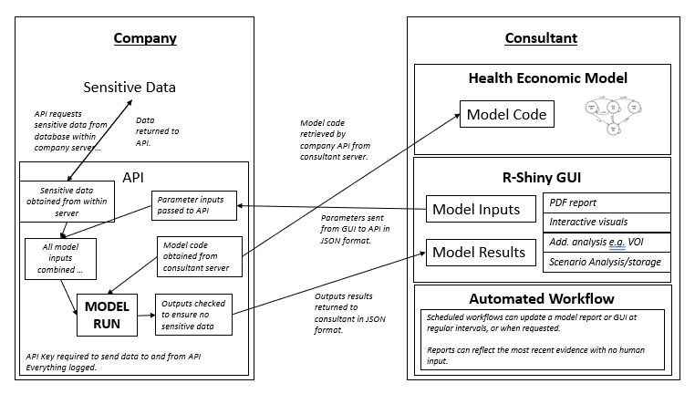

\bigskip 

```{r setup, include=FALSE}
knitr::opts_chunk$set(echo = TRUE, size = "tiny")
```

## Introduction

The development of economic models generally involves the transfer of sensitive data (e.g. individual patient or price data) between parties. This paper demonstrates how the use of APIs allows clients in the Health Economics & Outcomes Research (HEOR) industry to collaborate with multiple partners on health economic decision models, while,retaining full control of their data. The use of an API furthermore makes it possible to streamline and automate reporting as new information becomes available, significantly reducing the financial and administrative burden of economic model updates.

A recent publication by @adibi2022programmable describes a cloud-based model accessibility platform for models developed in R. The authors make the case for cloud based platforms to improve the accessibility, transparency and standardisation of health economic models, particularly highlighting the benefits of hosting computationally burdensome models on remote servers. The authors outline a framework for hosting models, contained within R packages, which are run using calls to an Application Program Interface (API). A set of standardised model call functions provide the user of the API with enough information to pass the necessary parameters to the model, run the model, and retrieve the necessary results directly into an R session. The publication is the first, to our knowledge, to discuss the enormous implications that remote model hosting could have in the HEOR industry.

[insert figure from the paper?]

We take this approach one step further, providing an open-source code base which demonstrates the ease at which APIs can be deployed on data servers to avoid the need to share sensitive data. In short, we propose that companies, with support from health economists, host their own model accessibility platforms. Our hope is that providing these materials will encourage others to use these, relatively new methods, to improve the transparency, accessibility and efficiency of health economic models.

## Method

We developed an automated analysis and reporting pipeline for health economic modelling It consists of three parts:

An economic model. The model can initially be developed using pseudo data – that is  randomly generated data, which has the same formatas the actual data, but does not contain any sensitive information.

An application programming interface (API). The API is hosted on the company / data provider side. It can be generated using the R package plumber.

An automated workflow is created. This workflow sends the economic model to the company API. The model is then run within the company server. The results are sent back to the consultant, and a (PDF) report is automatically generated using RMarkdown.

* This API server hosts all sensitive data, so that data does not have to be provided to other project partners.

* All of these processes can be controlled with a web-based user-interface. We provide an example user-interface built in the R shiny package, based on the tutorial application in our previous paper [@smith2020making]  [@shiny2021]. This application allows users to select input parameters with which to query the API, and view the results. This allows non-technical stakeholders to interact with the model in real time, while allowing the company to retain control of the data. The application will always reflect the data on the company server, and the model hosted by the consultant at the time of use.

```{r}
#| echo=FALSE, out.width="90%", 
#| fig.cap="Schematic showing the interaction between the Company API and the Consultant Automated Workflow"

```

All of the methods  discussed in this paper, as well as the code for the demonstration app can be found contained within an open access  [GitHub repository](https://github.com/RobertASmithBresMed/plumberHE).

### 1. The economic model

This model code has been amended from the DARTH group's open source Cohort state-transition model (the Sick-Sicker Model) which can be found in this [GitHub repository](https://github.com/DARTH-git/Cohort-modeling-tutorial/) and is discussed in @alarid2020cohort. The code includes several functions, but for the purpose of this example we can treat the model as a black box, as a single function called *run_model* which runs the DARTH Sick Sicker model. The *run_model* function takes a single argument, *psa_inputs*, which is a data-frame containing Probabilistic Sensitivity Analysis parameter inputs for the model variables that are allowed to vary. 

[a simple i -> f() -> o diagram might be useful?]

The data-frame has four columns:
* *parameter* - the name of the parameter (e.g. p_HS1)
* *distribution* - the distribution of that parameter (e.g. "beta")
* *V1* - the first parameter for the distribution in R (for beta this would be shape1, for normal this would be mean) 
* *V2* - the second parameter for the distribution in R (for beta this would be shape2, for normal this would be sd)

The *run_model* function returns a data-frame with six columns The first three columns are costs for each treatment option, and the second three columns are QALY for each treatment option. Each row represents the result of the model run for a set of inputs.

### 2. The API

An application programming interface is a set of rules, in the form of code, that allow different computers to interact with one another in real time. Whereas user-interfaces such as those generated by the R package *shiny* allow humans to interact with data, APIs are designed to enable computers to interact with data [@shiny2021].

When a 'client' application wants to access data, it initiates an API call (*request*) via a web-server, to retrieve the data. If this request is deemed valid, the API makes a call to an external program/server, the server sends a response to the API with the data, and the API transfers the data to the 'client' application. In a sense, the API is the broker (or middle-man) between two systems.

There are numerous benefits to APIs:
- in supporting programmatic access.  In contrast to what web applications offer (for example shiny apps), APIs allow users to access data, or other utilities (for example, proprietary applications) programmatically. Programmatic access enables users to invoke actions through an application or third-party tool. For example, R users can write a function that fetches or analyses data via an API and use this function in their workflow as any other user-defined function. This feature allows for greater data utilisation flexibility and faster integration with other software.
- in allowing cross-platform communications. Statisticians and decision-model developers can use different programming languages or packages. For example, APIs can allow a decision analytic model, developed in C++, to programmatically utilise data from a bayesian meta-analysis performed using python programming language.
- in aiding speed of collaboration between institutions, ensuring inputs and outputs are standardised so that applications can 'talk' to one another. Users from one institution need not to take into account the software or package used by their partners, but focus on how they would interact with the expected data.
- in security, eliminating the necessity to share data manually (e.g. via email). All interaction with data can be logged and access can be restricted by passwords and by limiting IP address access. For example, APIs can safely allow statisticians to programmatically accumulate sub-group summary-statistics from securely stored trial-data to inform a network meta-analysis.
- in expanding sharing avenues. For example, APIs can allow institutions to give limited access to their proprietary tools such as in-house decision-analytic models. Users of such tools can pass their data to the model and receive the respective outputs via the API.
- eliminating computational burden on the client side (since all computation is done on the API owner side).

There are lots of different implementations of APIs, but the main focus of this paper is on **Partner APIs**, which are created to allow data transfer between two different institutions. This requires a medium level of security, usually through the creation of access keys that are shared with partners.

In the examples below we use Javascript Object Notation (JSON), a data interchange format that is commonly used to transfer information between computers, to pass information to and from our API. Since the model is written in R, we convert back and forth between JSON and R data formats using the jsonlite R package [@jsonlite2014].

\tiny

```{r}
#| file='../R/darth_funcs.R', 
#| eval = F, echo = F
```

\normalsize

#### 2.2 plumber

The R package plumber allows programmers to create web APIs by decorating R source code with roxygen-like comments [@plumber2021citation, R2021citation]. These functions are then made available as API endpoints by plumber. 

The API can be called using a number of HTTP request methods (also known as HTTP verbs). The most-commonly used methods POST, GET, PUT, PATCH, and DELETE correspond to create, read, update, and delete operations, respectively. These annotations generate the API’s endpoint(s) and specify the operation(s) or response(s) the respective R function is responsible for generating. The below example shows the 'GET' request (the default for web-browsers).

The code below gives an example function which echos a message. The function takes one input, a string with the message, and outputs the message contained within a list. If this function was created in R it would return a list containing some text, like this:  `r    list(msg = paste0("The message is: '", "example_msg", "'"))`. 

\tiny

```{r}
#| eval = F, echo = T, 
#| attr.source='.numberLines',
#| fig.cap = "Example plumber function used to create an API which returns a message"

#* Echo back the input
#* @param msg The message to echo
#* @get /echo
function(msg="") {
  list(msg = paste0("The message is: '", msg, "'"))
}

```

\normalsize

The code for the model function uses the same principles, but is much more developed. There are three arguments to the model API; *path_to_psa_inputs*,  *model_functions* and *param_updates*.

The core API function created by plumber sources the model functions from software development website GitHub, obtains the model parameter data from within the API, and then overwrites the rows of the parameter updates that exist in *param_updates*. It then runs the model functions using the updated parameters, post-processes the results, checks that no sensitive data is included in the results, and then returns a data-frame of results. This entire process occurs in the server on which the API is hosted, with inputs and outputs passed to the API over the web in JSON format. 

\tiny

```{r}
#| file='../darthAPI/plumber.R',
#| eval = F, echo = T,
#| attr.source='.numberLines'

```

\normalsize

#### Deploying an API

There are numerous other providers of cloud computing services. The most convenient, yet not the cheapest, service is offered by RStudio Connect. An account is required for this, but once you have one it is possible to deploy the API directly from the Rstudio IDE. RStudio have a blog on how to publish an API created using Plumber to RStudio connect [here](https://www.rstudio.com/blog/rstudio-1-2-preview-plumber-integration/#:~:text=%20Resources%20%201%20Creating%20an%20API.%20On,APIs%20defined%20in%20your%20project%20and...%20More%20).

### Interacting with the API

We first show how to run the model from an R script, calling the API and retrieving the results of the model run. We then show how to use GitHub actions to automate the process, running the R script when triggered by an event (e.g. a data-update) or a scheduled time (e.g. the 1st of each month).

#### Interact with API from RScript

We use the *POST* function from the *httr* package to query the API [@httr2020citation] - as shown in the code chunk below. This function requires an internet connection. We provide values for several arguments:

* *url* - the URL of the RStudio Connect server hosting the API we have created using plumber. 
* *path* - the path to the API within the server URL.
* *query* & *body* - objects passed to the API in list format, with names matching the plumber function arguments.
* *config* - allows the user to specify the KEY needed to access the API.

The *content* function attempts to determine the correct format for the output from the API based upon the content type. This function ensures that the result object is a dataframe.

The script then then goes on to save the data and generate a PDF report from the outputs using the RMarkdown package [@rmarkdown2020citation], the code for which can be found [here](https://github.com/RobertASmithBresMed/plumberHE/blob/main/report/darthReport.Rmd). The markdown report uses functions adapted from the [*darkpeak*](https://github.com/dark-peak-analytics/darkpeak) R package. 

\tiny

```{r}
#| file='../scripts/run_darthAPI.R',
#| eval = F, echo = T, 
#| attr.source='.numberLines'

```

\normalsize

#### Use GitHub actions to automate the process

Once the API is created and hosted online, it can be called any time. The advantage of this is that any updates to either the model code, or the data used by the model, can be undertaken separately and the model re-run by either party. Calls to the API can also be scheduled at routine intervals. This would enable the health economic evaluation model report to be updated, without human interaction, at regular intervals to reflect the most up-to-date data.

In the example below we show how a GitHub Actions (other providers available) workflow can be used to automate an update to a health economic evaluation [@chandrasekara2021introduction]. The workflow runs at 0:01 on the first day of every month. It first clones the GitHub repository on a GitHub actions Windows 2019 server, then install the necessary dependencies, before running the script described above to generate the model report. It creates a pull request to the repo with this new updated report. If GitHub is not the preferred location of report storage, it is possible to send the report via email or save to cloud storage solutions such as Google Drive or Dropbox.

\tiny

```{r}
#| file='../.github/workflows/auto_model_run.yml',
#| eval = F, echo = T, 
#| attr.source='.numberLines'

```

\normalsize

## Discussion

As the collection & storage of large data sets has become more commonplace in health & health care settings, this data is increasingly being used to inform decision making. However, concerns about the security of this data, and the ethical implications about linked data sets, make the owners of this valuable resource particularly reluctant to share data with health economic modelling teams. The ability to host APIs on data-owners' servers, and send the model to the data rather than the data to the model, is one potential solution to this problem. The example described in this paper may be relatively simple, but gives a tech savvy health economist everything they need to set up a modelling framework which does not rely on the sharing of data by a company (or other data-owner).

The framework described has a number of benefits. 

* Firstly, no data needs to leave the data-owner's server. This is likely to significantly reduce administrative burden for both the company and the consultant, and reduce the number of data-leaks.  

* Separating the data from the model has significantly improved the transparency of the health economic model. Allowing others to critique methods & hidden structural assumptions, test the code and identify bugs should improve the quality of models in the long run. It also enables the pool of people working on developing the health economic model and accompanying user-interface to be widened, without concern for confidentiality & data security. For example a shiny application could be developed for a model built under this framework without the programmer needing access to any sensitive data or information.

* The computational burden of the model is handled on a remote server. The power of these servers is typically considerably greater than that of a typical laptop, speeding up model run time considerably, especially. This is likely to be especially important for models that incorporate uncertainty through monte-carlo sampling algorithms which can be parallelized on machines with multiple cores @parallelmanual2020, for example probabilistic one way sensitivity analysis [@mccabe2020one] or partial expected value of perfect information [@brennan2007calculating]. 

* The use of APIs to perform distinct tasks can improve interoperability within the field of health economics. Different modules, or tasks within a modelling framework can be written in different languages (e.g. R, Python, Julia & C++) and linked using APIs. This is likely to improve collaboration between different sub-disciplines, which often use different languages (e.g. health economists in R and data-scientists in Python).

* API calls can be made at any time, and will always reflect the data held by the company. In many cases these datasets are updated regularly, allowing companies, and other stakeholders, to see the results of the decision model based on the most up to date data, without needing human intervention to: send new datasets, re-run analysis, write a report, and provide that report in a suitable format for the company. Automating model updates at set schedules, or when data is updated, may be invaluable where data is updated regularly, as has been the case throughout the COVID-19 pandemic.
* Any model can be passed to the API, as long as the inputs and outputs to the model meet the requirements of the API. This means that multiple health economic models could be passed to the API, to be run using the data on the company server, and compared to account for structural uncertainty. 

However, the framework has a number of limitations: 

* Firstly, the method is relatively complex, and requires a strong understanding of health economic modelling in R, API creation and hosting, RMarkdown or other automated reporting packages, and GitHub Actions. While we hope that this paper provides a useful resource to health economists seeking to utilise these methods, the bulk of the industry still operates in MS Excel. Providing tuition to upskill health economists, or creating teams consisting of both health economists and data-scientists & software engineers may mediate this limitation somewhat. The [R for HTA consortium](https://r-hta.org/) has the potential to play a crucial role in upskilling the industry.

* There are still likely to be concerns about data security, even with the authentication procedures built in to the API functionality. Collaboration with experts in this field may mediate this significantly, since there is no fundamental reason why health data is any more sensitive, or vulnerable, than the plethora of other data (including banking data) that relies on APIs every day. It will be important to reassure companies that the use of APIs is likely to reduce, not increase the risk of data breaches, and that every interaction with the data can be logged. 

* There is a risk that running the model remotely will result in the perception that the model is a 'black box'. The use of user-interfaces (such as those increasingly being created in shiny) to interrogate the model, as well as the increased transparency associated with being able to share code on sites such as GitHub, should reassure stakeholders that this framework is more transparent than the existing spreadsheet based solutions.

* Often, when building a model, it is helpful to have the underlying data to be able to investigate the data, often through the generation of descriptive statistics. The process of sharing pseudo-data enables modellers to ensure that the models they create conform to the structure of the data input. However, the modeller still needs to be able to write code that is versatile enough to cope with data with unknown distributions & ranges. Code that will not break when the number of observations changes, or when the range or distribution of a variable changes. This is easily solved, again by improved training and the use of standard packages.   

The recent working paper by @adibi2022programmable has provided a similar call to action, extolling the virtues of the API for decision modelling, and showing how APIs can be used to shift much of the computational burden away from those querying models, making models more accessible. However, there are several limitations to this brilliant paper. Firstly, while the authors outline a framework for making models more transparent and accessible, and describe how they have done this for a number of models using the PRISM server, they do not provide instruction on how to replicate this process. Additionally, while the authors state that “A practical model accessibility platform should be able to protect confidential information such as patient data and confidential pricing” (p6), the framework as described would require companies to give the owners of the model accessibility platform access to their confidential data, or else host the model accessibility platform themselves. 

This paper has attempted to address some of these limitations, providing open source code for the creation and deployment of an API with an accompanying automated health economic evaluation update framework. It also provides clearly described open source code on two new pieces of additional functionality not previously described elsewhere; firstly it demonstrates how companies can host APIs themselves to negate the need to share data with subject experts, and secondly it demonstrates how model updates can be automated with scheduled workflows run on remote servers.


## Conclusions

This example framework, with accompanying open source code base, demonstrates that it is possible, within a HEOR setting, to separate the health economic model from the data, and automate the main steps of the analysis pipeline. We believe this is the first application of this procedure for a HEOR project, and is certainly the first example to be made open source for the benefit of the wider community. We hope that this framework will improve the transparency of health economic models, reduce the cost & administrative burden of updating models, and increase the speed at which updates can occur.

## Author contributions

R.S. & P.S. developed the original concept, R.S. wrote the source code & the original article. W.M. & P.S. reviewed both the source code and article. All errors are the fault of R.S.

## Competing interests

R.S., P.S. & W.M have no competing interests to declare.

## Grant information

R.S., P.S. & W.M. are jointly funded by the Wellcome Trust Doctoral Training Centre in Public Health Economics and Decision Science [108903] and the University of Sheffield.

*The funders had no role in study design, data collection and analysis, decision to publish, or preparation of the manuscript.*

## Software availability

Source code is available on GitHub at **Insert Final GitHub repo Link**. 

Archived source code at the time of publication can be found at **Insert Zenodo Link**.

Licence: MIT

## Acknowledgements

We would like to thank the participants at R-HTA Oxford, Richard Birnie (Lumanity) and Dawn Lee (Lumanity) for feedback on the original concept and manuscript. All errors are the fault of the authors.
